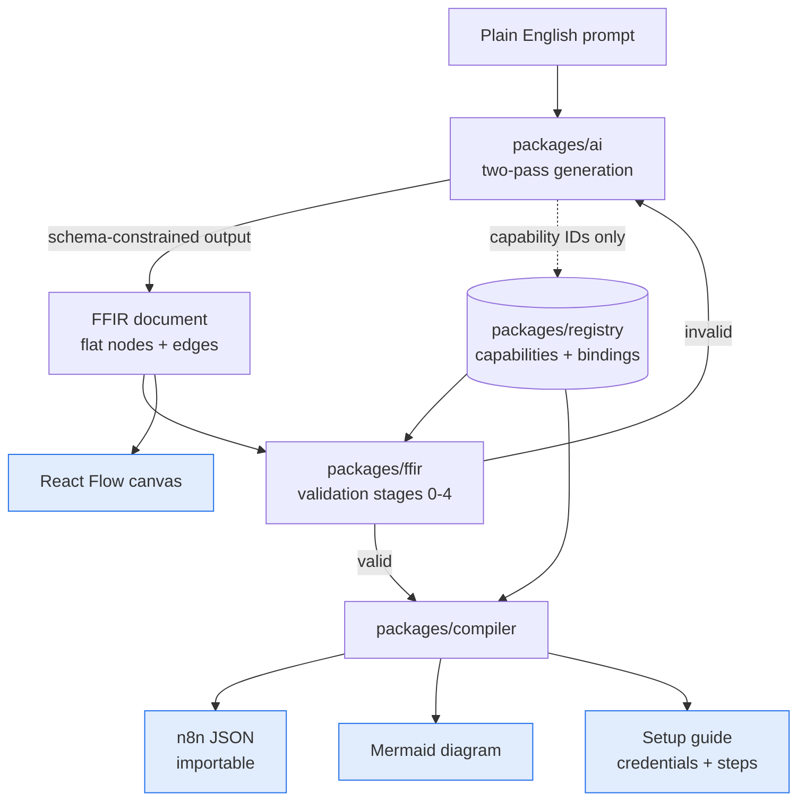

# FlowForge AI (Portfolio Piece)

**One-liner:** Describe an automation in plain English, get a working n8n
workflow blueprint: interactive flow diagram, importable JSON, and a setup guide.

- **Status:** Architecture frozen. Implementation started, M6b of 23 done.
- **Effort:** Large. See [DEVELOPMENT_ROADMAP.md](docs/DEVELOPMENT_ROADMAP.md)
  for 23 session-sized milestones. Next up is M7, the renderers.
- **Why it exists:** The headline portfolio piece. A real AI SaaS with a
  non-trivial engineering core, not a wrapper around a chat completion.

## What It Is

A user writes "when a Stripe charge succeeds, post the amount to #finance in
Slack". FlowForge returns four things: an interactive visual flow, a mermaid
diagram, importable n8n JSON, and a setup guide listing every credential needed.

The hard part is not calling a model. It is stopping the model from inventing
n8n node parameters that look correct and fail at runtime.

## Architecture



The model writes FFIR. Everything else is a pure function of that document, so
three of the four artifacts are unit-testable and only one surface can
hallucinate. `packages/ai` has no import path to `packages/compiler`, which is
what keeps platform knowledge out of the prompt. See
[PROJECT_STRUCTURE.md](docs/PROJECT_STRUCTURE.md) for the enforced dependency
rule.

## The Four Invariants

Every document depends on these. A change that breaks one breaks the
architecture, so check them first.

**1. Claude produces FFIR and nothing else.**
Everything the user sees is derived from one model output. n8n JSON is a compile
of it, mermaid is a render of it, the setup guide is a render of it joined
against the registry. Four artifacts, one hallucination surface, and three of
them unit-testable.

**2. FFIR is flat and non-recursive.**
Nodes and edges are sibling arrays with string-ID references. Branching and
looping are edge properties, not nesting. This is what allows strict JSON-schema
enforcement of model output, which is what makes invented parameter names
structurally impossible.

**3. The AI layer never learns about a target platform.**
`packages/ai` cannot import `packages/compiler`, enforced in CI. Platform
knowledge lives entirely in registry bindings and compiler targets. Adding
Make.com is one `Target` plus per-capability bindings, and zero prompt changes.

**4. Validation does not trust its input's origin.**
Every document passes the same pipeline whether it came from the model, a human,
or the public marketplace. The strongest guarantee in the system is a property of
one model provider, so nothing is allowed to depend on it alone.

## Roadmap

23 session-sized milestones across four phases. Full detail, checkpoints, and cut
lines in [DEVELOPMENT_ROADMAP.md](docs/DEVELOPMENT_ROADMAP.md).

| Phase | Milestones | What lands | Status |
| --- | --- | --- | --- |
| 1. The Engine | M1 to M9 | FFIR, validation, registry, n8n compiler, renderers, AI layer. No UI. | In progress, M6b of 9 |
| 2. The Service | M10 to M13 | Postgres, durable jobs, API and SSE, auth and tenancy, metering | Not started |
| 3. The Product | M14 to M19 | Results view, canvas, generation UX, chat iteration, dashboard, landing | Not started |
| 4. Durability | M20 to M23 | Registry generator, eval harness, observability, marketplace | Not started |

**Current milestone: M6b complete.** The compiler works end to end: a plain FFIR
document compiles to an n8n workflow JSON file, deterministically, with a golden
file per node kind. Next is M7, the renderers.

## Documents

Read in this order.

| Document | Owns |
| --- | --- |
| [WORKFLOW_SCHEMA.md](docs/WORKFLOW_SCHEMA.md) | FFIR: the schema, the expression grammar, all 19 validation rules, document limits |
| [NODE_REGISTRY.md](docs/NODE_REGISTRY.md) | Capability IDs, registry format, bindings, the generator, degradation policy |
| [COMPILER_ARCHITECTURE.md](docs/COMPILER_ARCHITECTURE.md) | FFIR to n8n and beyond, the `Target` interface, node-kind lowering |
| [AI_SPEC.md](docs/AI_SPEC.md) | Two-pass generation, provider abstraction, prompts, retry, validation stages 2 and 3 |
| [SYSTEM_ARCHITECTURE.md](docs/SYSTEM_ARCHITECTURE.md) | Runtime topology, durable jobs, API, data model, tenancy, metering |
| [SECURITY.md](docs/SECURITY.md) | Threat model, secret handling, tenant isolation, marketplace gating |
| [OBSERVABILITY_AND_EVALS.md](docs/OBSERVABILITY_AND_EVALS.md) | Telemetry, metrics, the eval harness, prompt versioning |
| [PROJECT_STRUCTURE.md](docs/PROJECT_STRUCTURE.md) | Workspace layout, the dependency rule and its enforcement |
| [DEVELOPMENT_ROADMAP.md](docs/DEVELOPMENT_ROADMAP.md) | 23 milestones, checkpoints, cut lines |

Source material: the Product Strategy and Design System documents. Those define
what to build and how it looks. These nine define how it works.

## Stack

pnpm TypeScript monorepo. Next.js on Vercel, Postgres, a job worker, Claude via
the Anthropic API behind a provider interface. React Flow for the canvas.

## Running It

```
pnpm install
pnpm test        # every package
pnpm typecheck
```

Requires Node 20.11 or newer and pnpm 10. Built so far: `packages/config`,
`packages/ffir` (types, JSON Schema, the expression parser, and validation
stages 0, 1, and 4), `packages/registry` (artifact schemas, the versioned
loader, the resolver, alias search, validation stages 2 and 3, and a
hand-written six-integration build under `fixtures/`), `packages/compiler` (the
full six-stage pipeline and the n8n target, with golden files covering every
node kind), and `packages/ai` (so far only a re-export of validation stages 2
and 3; the provider interface and the generation passes arrive in M8).

## What It Proves to a Client

Schema design, compiler construction, LLM grounding against a real API surface,
multi-tenant SaaS architecture, and the judgment to know that the interesting
problem was never the prompt.

## Definition of Done

A stranger describes an automation, downloads the JSON, imports it into their own
n8n, connects their credentials, and it runs.
